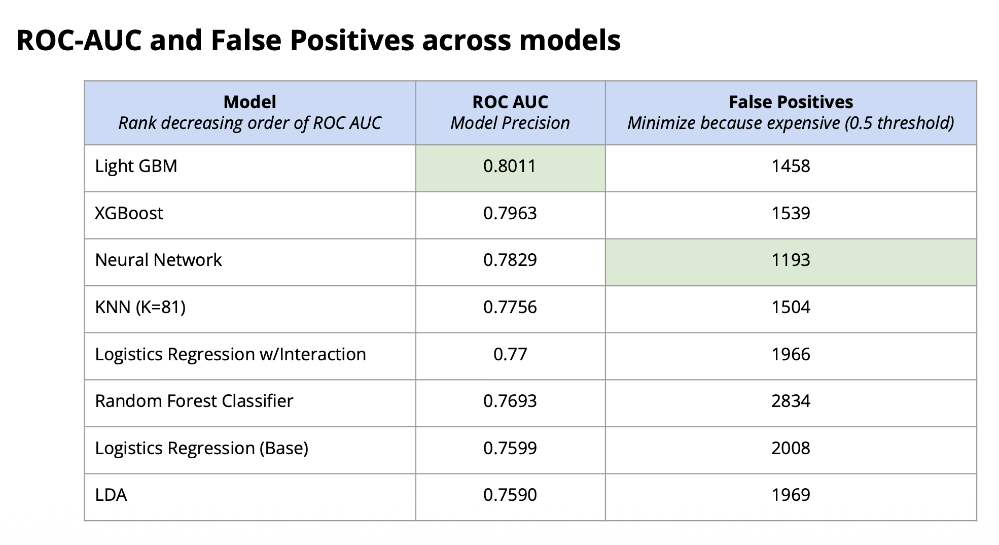
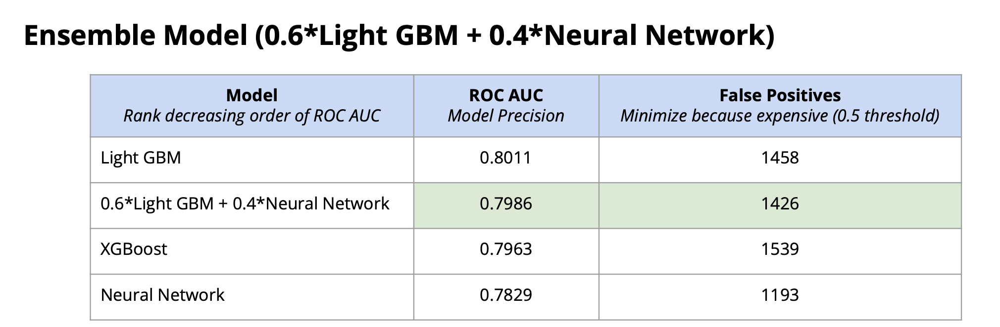

# Algorithmic Optimization for Insurance Lapse Prediction
An End-to-End Predictive and Architectural Framework Using Non-Parametric Ensemble Methods

## Problem Statement
Customer retention is a strategic imperative in the insurance sector. Because the cost of acquiring a new customer significantly exceeds the cost of retaining an existing one, accurate predictive models directly impact overall corporate profitability. Furthermore, unexpected policy lapses disrupt projected cash flows, creating significant liquidity risks within asset-liability management (ALM).  

The core challenge in lapse prediction is structural and behavioral heterogeneity: policyholders lapse for vastly different reasons, and financial features often exhibit massive skewness or zero-variance profiles within specific subgroups. 

This project explores the mathematical differences in how diverse algorithms capture policyholder behavior —moving from classic parametric baselines to advanced ensemble architectures—to construct an optimal, low-false-positive deployment framework.  

## Methodology
To ensure a robust, deployment-ready pipeline, the analysis executed the following technical steps:

(1) Advanced Missing Data Imputation: 
Evaluated Median, $K$-Nearest Neighbors (KNN), and Quantile Regression models on artificial missing blocks. Quantile Regression achieved the lowest Mean Squared Error (MSE) for highly skewed financial columns and was leveraged for overall missing data treatment.  

(2) Behavioral Target Alignment: 
Conducted an Adversarial Classifier Test ($AUC = 0.681$) and Factor Analysis of Mixed Data (FMD) to mathematically confirm that voluntary "Lapse" and "Surrender" profiles overlap heavily in feature space, validating their combination into a single binary target (IS_LAPSE).  

(3) Response Curve Correction: 
Identified inverted sigmoid relationships between log-odds and key financial indicators (Premium, Benefit). Corrected this by flipping the target variable space to continuous compliance (CONTINUE = 1 - IS_LAPSE) to align cleanly with logistic and distance-based model assumptions.  

(4) Multicollinearity Cleanse: 
Evaluated Variance Inflation Factors (VIF) on the training set to prevent data leakage. Dropped highly redundant categories (e.g., POLICY TYPE 2) and condensed collinear levels (NLG Not Active, NLG Suspend, NO NLG) into a singular Inactive feature space.  

(5) Assumption & Specification Diagnostics: 
Subjected baseline models to strict diagnostics, utilizing the Box-Tidwell test for log-odds linearity and the Ramsey RESET test for structural misspecification.  

(6) Ensemble & Meta-Learning: 
Built out individual predictive models across distance, parametric, tree, and gradient boosting architectures, culminating in an optimized soft-voting ensemble.  

## Dataset Overview
The analysis was conducted on an extensive life insurance policy dataset comprising 185,560 unique records across 19 initial predictors. Features track:  

- Demographics: Entry Age, Sex.
- Policy Parameters: Policy Type (Classes 1–3), Original Face Amount (Initial Benefit), Current Death Benefit, Policy Duration (Decimal Years).
- Financial Attributes: Premium Amount, Payment Mode (Monthly, Quarterly, Semiannually, Single Premium, Annually), Number of Future Premiums Paid in Advance.
- Risk & Underwriting: Non-Lapse Guaranteed (NLG) Status, Substandard Risk Score (extra mortality risk metrics).

Data was partitioned using a robust 85% training/testing split, with the training block further sub-split into a 70% model training set and a 30% internal validation set.  

## Diagnostic Results & Model Performance1. 
(1) Baseline Model Violations
- Box-Tidwell Test: Returned highly significant $p$-values across almost all continuous inputs, confirming that the relationships between predictors and log-odds are deeply non-linear.
- Ramsey RESET Test: Heavily rejected the null hypothesis of proper specification ($\text{LR Statistic} = 539.5159$, $p < 0.0001$), proving a standard logistic framework misses crucial multi-way interactions.
- Matrix Singularity & Certainty Traps: Discriminant Analysis (QDA) and Naive Bayes architectures completely collapsed. Diagnostics revealed that the feature NUMBER OF ADVANCE PREMIUM has exactly $0\%$ variance (all zeros) within the Lapse group, preventing matrix inversion and zeroing out joint probability products.

(2) Standalone vs. Ensemble Model Comparison
Because false positives are highly expensive in an insurance framework—causing companies to waste precious retention budget and marketing resources on loyal policyholders —minimizing False Positives (FP) at a standard $0.5$ classification threshold was set as a primary architectural constraint. Refer to the diagram below for the modeling results

Final Model Selection: A weighted blend of $0.6 \times \text{LightGBM} + 0.4 \times \text{Neural Network}$ was engineered. 

This structure effectively harvests the high generalizability of LightGBM alongside the non-linear interaction mastery of the Deep Learning network, dropping false alarms to their lowest relative footprint without degrading global discrimination.  

## Behavioral Insights: The Churn Hierarchy

By evaluating and cross-referencing feature importances across macro and micro-focused models, this project establishes a distinct behavioral hierarchy for policy churn:   

MACRO-DRIVERS (The "Who"): Policy Year (Decimal), Payment Mode (Monthly)  
MICRO-DRIVERS (The "Tipping Point"): Premium Price Thresholds, Zero Advance Premium Flags 

(1) Macro-Drivers (The "Who"): 
Random Forest and XGBoost prioritize global attributes. Policy Year (Decimal) and Payment Mode (Monthly) act as the most foundational risk filters. Shorter tenures coupled with high payment frequencies provide repeated behavioral "opportunities" for a consumer to deliberately terminate coverage. High-risk profiling isolates monthly-paying clients sitting right at their 1-to-2 year policy re-evaluation marks.  

(2) Micro-Drivers (The "Tipping Point"): 
LightGBM and Neural Network architectures zoom into local split branches to capture micro-level triggers. Once a consumer falls into a high-risk macro profile, specific local constraints like exact Premium price points, Entry Age, and an absolute absence of advance payments trigger the actual lapse. Within localized clusters, an advance payment count of exactly zero serves as a near-absolute functional indicator of churn.  

## Resources
- insurance_data_cleaned.csv: The processed and imputed life insurance dataset containing 185,537 polished records ready for machine learning tasks.
- analysis_report_deck.pdf: Executive presentation and slide deck detailing data diagnostics, exploratory data visualizations, and comparative model performance benchmarks.
- data_cleaning_EDA.ipynb: Jupyter notebook containing the preliminary data profiling, distribution channel analysis, and the deployment of Quantile Regression models for high-accuracy missing value imputation.
- feature_engineering.ipynb: Jupyter notebook executing advanced structural transformations, including log-scaling heavily skewed financial variables, correcting response curves (CONTINUE), and addressing high-VIF multicollinearity.
- data_analysis.ipynb: Jupyter notebook housing the algorithmic sandbox where parametric baselines (Logistic Regression, LDA), distance metrics (KNN), and non-parametric ensembles (XGBoost, LightGBM, Neural Networks) are built, evaluated, and blended into the final optimized ensemble.

## Acknowledgements
This project was completed as an independent research project under the module STSCI 4990: Independent Project at Cornell University. Appreciation is extended to my academic advisor, Quinn Simonis, for their structural and algorithmic guidance throughout the semester.  
